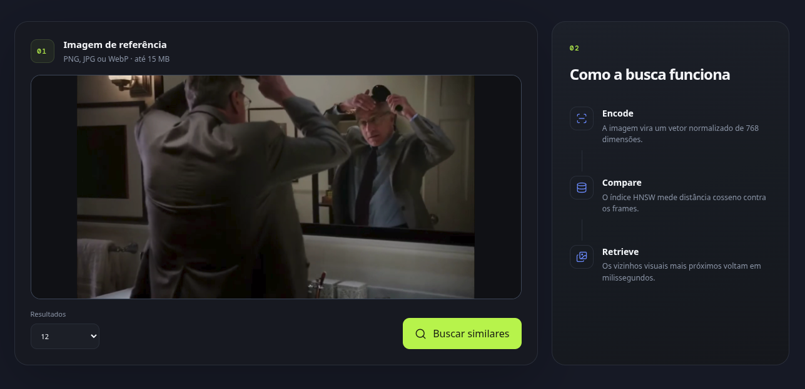
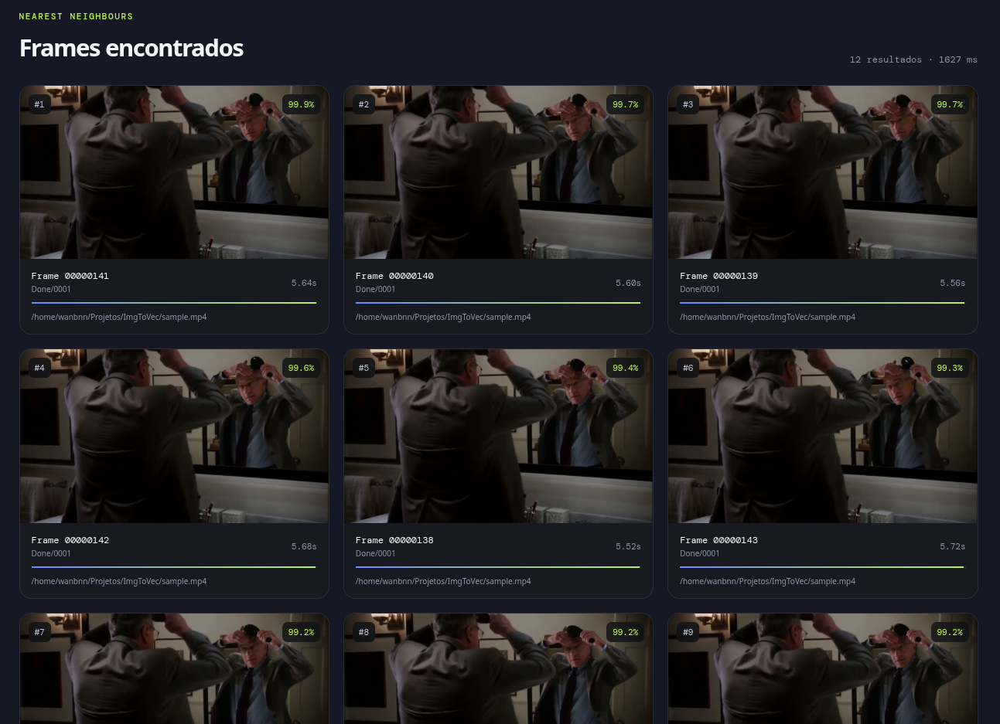
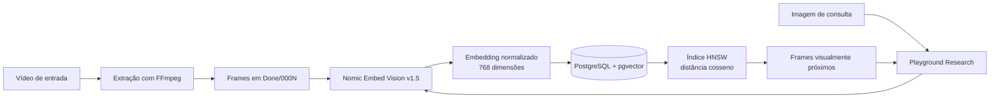
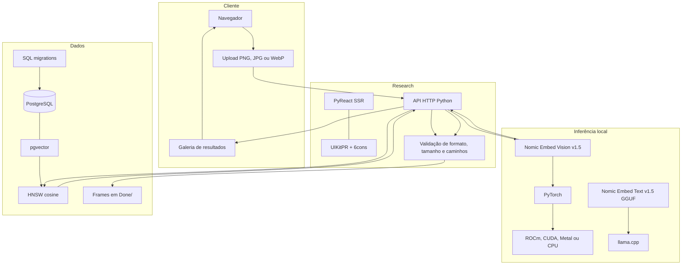

# ImgToVec

ImgToVec é um pipeline local de busca visual reversa para vídeos. Ele extrai todos os frames de um vídeo, gera embeddings visuais normalizados, armazena os vetores no PostgreSQL com pgvector e oferece um playground web onde uma imagem enviada pelo usuário encontra os frames visualmente mais próximos.

O projeto roda localmente, suporta aceleração por GPU e não precisa enviar as imagens para uma API externa.

## Demonstração

No playground Research, o usuário seleciona ou arrasta uma imagem de referência e escolhe quantos vizinhos deseja recuperar:



O resultado apresenta os frames mais próximos, a similaridade vetorial, o número do frame, a pasta do vídeo e o instante correspondente:



## Como funciona



O `nomic-embed-vision-v1.5` transforma diretamente os pixels em vetores, sem criar legendas. Ele compartilha o espaço vetorial com o `nomic-embed-text-v1.5`, deixando o projeto preparado para buscas texto → imagem além da busca imagem → imagem já implementada.

O pipeline segue o pré-processamento oficial do Nomic: imagens usam o token CLS + normalização L2; textos usam mean pooling + LayerNorm + normalização L2. Consultas detectadas como português são traduzidas localmente para inglês antes da vetorização.

## Arquitetura



O encoder fica carregado na memória depois da primeira consulta. O PostgreSQL armazena somente os metadados e vetores; os arquivos dos frames continuam em `Done/` e são entregues apenas depois de uma validação contra os registros do banco.

## Recursos

- Detecção e build automática do llama.cpp para CPU, CUDA, ROCm/HIP ou Metal.
- Detecção da GPU AMD principal por PCI e VRAM, incluindo alvos RDNA4 como `gfx1200`.
- Extração sem reamostragem de todos os frames via FFmpeg.
- Uma pasta numerada por vídeo em `Done/`.
- Download automático dos encoders Nomic para `Models/`.
- Processamento em lotes com retomada: somente frames pendentes são processados.
- PostgreSQL com migrations, pgvector e índice HNSW por distância cosseno.
- Hash SHA-256 e estado de processamento para cada frame.
- Playground responsivo feito com PyReact, PRPM, UIKitPR e 6cons.
- Upload em memória, limite de 15 MB e acesso restrito aos frames catalogados.

## Requisitos

- Python 3.11 ou mais recente.
- PostgreSQL com a extensão pgvector.
- FFmpeg e FFprobe.
- Git, CMake e compilador C++17 para compilar o llama.cpp.
- PyTorch e Torchvision adequados ao backend da máquina.

## 1. Configurar o PostgreSQL

Exemplo com Docker:

```bash
sudo docker run --name postgres \
  -e POSTGRES_USER=wanbnn \
  -e POSTGRES_PASSWORD=1234 \
  -p 5432:5432 \
  -d pgvector/pgvector:pg17
```

Crie o arquivo local de configuração:

```bash
cp .env.example .env
```

Variáveis disponíveis:

```dotenv
POSTGRES_USER=postgres
POSTGRES_PASSWORD=change-me
POSTGRES_SERVER=127.0.0.1
POSTGRES_PORT=5432
POSTGRES_DB=img_to_vec

LLAMA_EMBED_MODEL=Models/nomic-embed-text-v1.5.Q4_K_M.gguf
LLAMA_EMBED_REPO=nomic-ai/nomic-embed-text-v1.5-GGUF
LLAMA_EMBED_FILE=nomic-embed-text-v1.5.Q4_K_M.gguf

VISION_EMBED_MODEL=nomic-ai/nomic-embed-vision-v1.5
VISION_EMBED_DIR=Models/nomic-embed-vision-v1.5
VISION_DEVICE=auto
FRAME_BATCH_SIZE=16
EMBEDDING_DIM=768
```

Se `POSTGRES_DB` ainda não existir, o inicializador tenta criá-lo automaticamente antes de aplicar as migrations.

## 2. Preparar o ambiente Python

No Arch Linux com ROCm:

```bash
sudo pacman -S python-pytorch-rocm python-torchvision
python3 -m venv --system-site-packages .venv
source .venv/bin/activate
python3 -m pip install -r requirements.txt
```

Em CUDA, Metal ou CPU, instale primeiro a distribuição apropriada do PyTorch e crie a venv com acesso a ela.

Aplicar migrations:

```bash
./migrate.py
```

A migration cria:

- `schema_migrations` para controle de versões;
- `videos` para vídeos, pastas, metadata e progresso;
- `frames` para hashes, caminhos, estados e `vector(768)`;
- índice HNSW com `vector_cosine_ops`.

## 3. Compilar o llama.cpp

```bash
./build_llama_cpp.py
```

O instalador detecta o melhor backend disponível. Também é possível escolher explicitamente:

```bash
./build_llama_cpp.py --backend rocm
./build_llama_cpp.py --backend cuda
./build_llama_cpp.py --backend metal
./build_llama_cpp.py --backend cpu
```

A saída fica em `llama.cpp/build-<backend>/bin/`. O build do llama.cpp é usado pelo encoder textual Nomic e deixa o projeto preparado para consultas texto → imagem no mesmo espaço vetorial.

## 4. Extrair frames

```bash
./extract_video_frames.py meu-video.mp4
```

Cada execução cria uma pasta para o vídeo inteiro:

```text
Done/
├── 0001/
│   ├── frame_00000001.png
│   ├── frame_00000002.png
│   └── metadata.json
└── 0002/
    ├── frame_00000001.png
    └── metadata.json
```

Outros formatos:

```bash
./extract_video_frames.py meu-video.mp4 --format jpg --quality 2
./extract_video_frames.py meu-video.mp4 --format webp
```

## 5. Gerar embeddings

Os modelos ausentes são baixados automaticamente. Para antecipar o download:

```bash
./download_models.py
```

Processar todos os frames pendentes:

```bash
./process_frame_vectors.py
```

Teste limitado:

```bash
./process_frame_vectors.py --limit 10
```

O processador pode ser interrompido e retomado. Pastas concluídas com o mesmo encoder são ignoradas, e frames alterados são detectados pelo hash.

Se a versão do pré-processamento mudar, o identificador persistido também muda e os frames antigos voltam automaticamente ao estado pendente. Depois de atualizar o projeto para a versão CLS, execute novamente:

```bash
./process_frame_vectors.py
```

É necessário reprocessar todo o acervo; o Research não mistura embeddings antigos com os vetores CLS novos.

## 6. Executar o Research

```bash
cd research
prpm install
prpm run dev
```

Abra <http://127.0.0.1:3000> e escolha um dos modos:

- **Imagem:** envie uma referência PNG, JPG ou WebP.
- **Texto:** descreva a cena desejada, por exemplo `um homem de terno olhando para um espelho`.

A busca textual inicia automaticamente o `llama-server`, aplica o prefixo `search_query:` exigido pelo Nomic e compara o vetor textual com os embeddings visuais. A primeira busca carrega o encoder correspondente na GPU; as seguintes reutilizam o modelo residente.

Quando a descrição está em português, o Research detecta o idioma e usa localmente `Helsinki-NLP/opus-mt-ROMANCE-en`. A tradução e o texto efetivamente vetorizado são devolvidos pela API; nenhum serviço externo recebe a consulta.

O endpoint principal é:

```text
POST /api/search?limit=12
Content-Type: image/png | image/jpeg | image/webp
Body: bytes da imagem
```

Busca textual:

```text
POST /api/search?limit=12
Content-Type: application/json
Body: {"query": "uma pessoa usando terno escuro"}
```

## Estrutura

```text
.
├── build_llama_cpp.py          # instala e compila llama.cpp
├── extract_video_frames.py     # vídeo → frames
├── download_models.py          # baixa encoders ausentes
├── process_frame_vectors.py    # frames → embeddings → pgvector
├── migrate.py                  # executor de migrations
├── migrations/                 # schema PostgreSQL
├── Models/                     # modelos locais, ignorados pelo Git
├── Done/                       # frames locais, ignorados pelo Git
└── research/                   # playground PyReact
```

## Observações

- Os modelos, frames, vídeos, builds, ambientes virtuais e `.env` não são versionados.
- Somente frames que já possuem embedding podem aparecer na busca.
- A similaridade exibida é `1 - distância cosseno`.
- Para produção, coloque o Research atrás de um proxy com autenticação e TLS.
